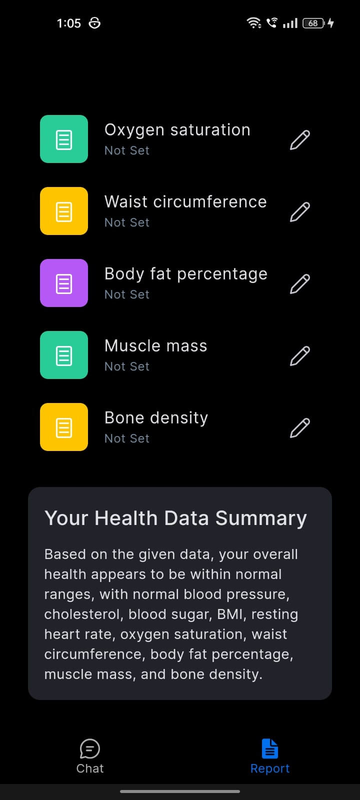
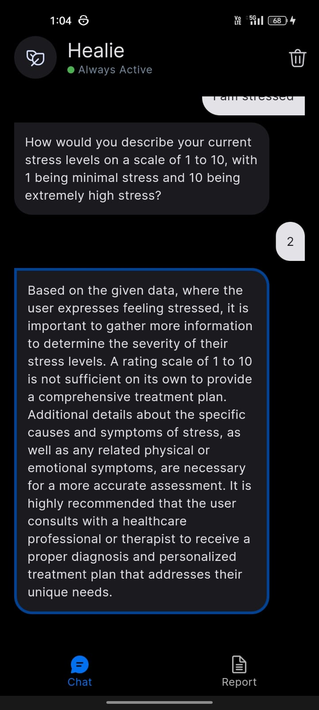
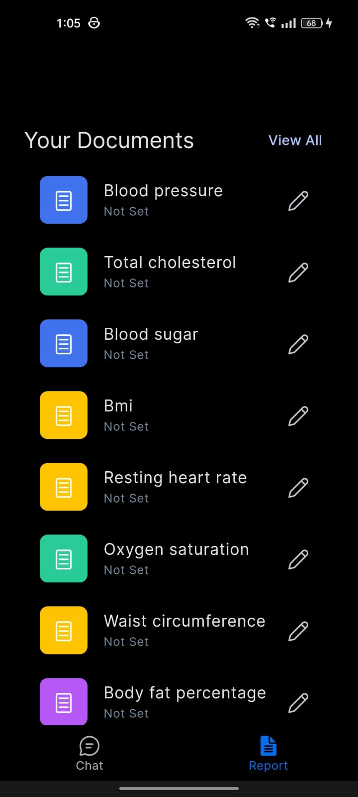

# HEALIE

### **Frontend (Flutter) README:**

# Healthcare AI/ML Frontend - Flutter

This is the Flutter-based frontend for our award-winning healthcare project, developed for ScaleHack'24 - Med Hack, where we won the 'Best Use of AI/ML' award.

## Features

-   User-friendly interface designed for healthcare applications.
-   Smooth integration with the backend powered by FastAPI.
-   Supports real-time interaction with healthcare data.

## Tech Stack

-   **Flutter**: Cross-platform mobile development framework.
-   **Dart**: The programming language for Flutter.
-   **AI/ML**: The backend provides AI/ML functionalities.

## Getting Started

### Prerequisites

-   Flutter SDK installed ([Installation Guide](https://flutter.dev/docs/get-started/install))
-   A connected device or emulator for testing.

### Setup Instructions

1. Clone the repository:
    ```bash
    git clone https://github.com/yourusername/healthcare-flutter-frontend.git
    ```
2. Navigate to the project directory:
    ```bash
    cd healthcare-flutter-frontend
    ```
3. Install dependencies:
    ```bash
    flutter pub get
    ```
4. Run the app:
    ```bash
    flutter run
    ```

### Screenshots






## Contributors

-   **MOOSA FAYAZ** - UI Design
-   **Basith P** - Frontend Development
-   **Muhammed Zafar MM** - Project Flow and Backend

## License

This project is licensed under the MIT License. See the [LICENSE](LICENSE) file for details.
