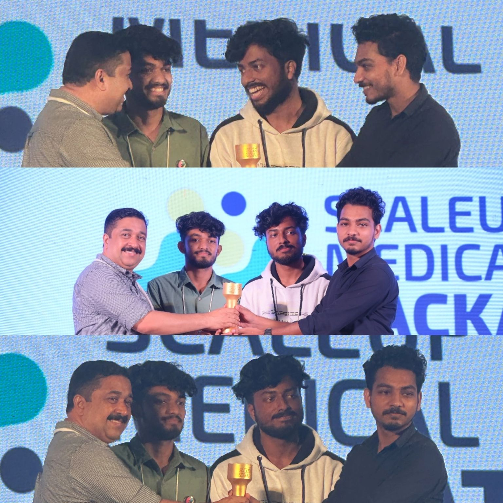
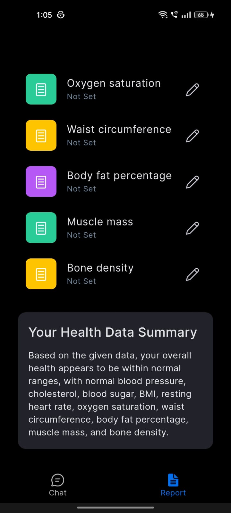
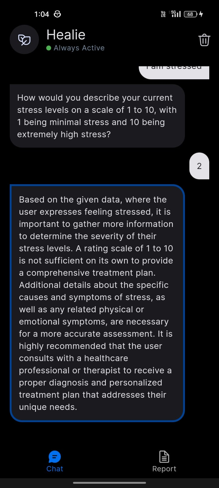
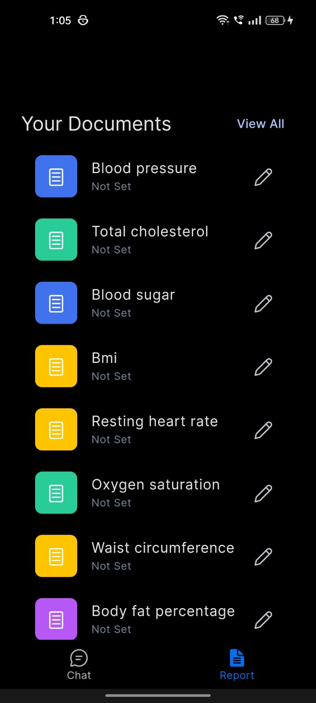
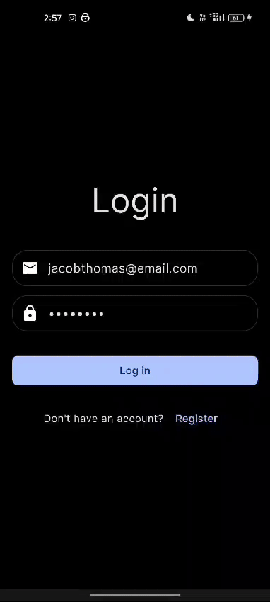

# HEALIE

### **Frontend (Flutter):**

> [!NOTE]
>  Backend Repository: [github.com/mzafarm/healie-backend](https://github.com/mzafarm/healie-backend)

This is the Flutter-based frontend for our award-winning healthcare project, developed for Kerala Government backed ScaleHack'24 - Med Hack, where we won the 'Best Use of AI/ML' award.



> Photo: Award presentation by [Mr. Najeeb Kanthapuram, MLA (Kerala Legislative Assembly)](https://www.linkedin.com/in/najeeb-kanthapurm-mla-058968266/) with [Moosa Fayas](https://www.linkedin.com/in/moosafayaz/), [Me](https://www.linkedin.com/in/muhammed-zafar-mm/), [Basith P](https://www.linkedin.com/in/basithp9/).

## Features

-   User-friendly interface designed for healthcare applications.
-   Smooth integration with the backend powered by FastAPI.
-   Supports real-time interaction with healthcare data.

## Tech Stack

-   **Flutter**: Cross-platform mobile development framework.
-   **Dart**: The programming language for Flutter.
-   **AI/ML**: The backend provides AI/ML functionalities.

## Getting Started

### Prerequisites

-   Flutter SDK installed ([Installation Guide](https://flutter.dev/docs/get-started/install))
-   A connected device or emulator for testing.

### Setup Instructions

1. Clone the repository:
    ```bash
    git clone https://github.com/MZaFaRM/Healie.git
    ```
2. Navigate to the project directory:
    ```bash
    cd Healie
    ```
3. Install dependencies:
    ```bash
    flutter pub get
    ```
4. Run the app:
    ```bash
    flutter run
    ```

### Screenshots

<table>
  <tr>
    <td></td>
    <td></td>
  </tr>
  <tr>
    <td></td>
    <td>
    
    </td>
  </tr>
</table>

## Contributors

-   **MOOSA FAYAZ** - UI Design
-   **Basith P** - Frontend Development
-   **Muhammed Zafar MM** - Project Flow and Backend

## License

This project is licensed under the MIT License. See the [LICENSE](LICENSE) file for details.
